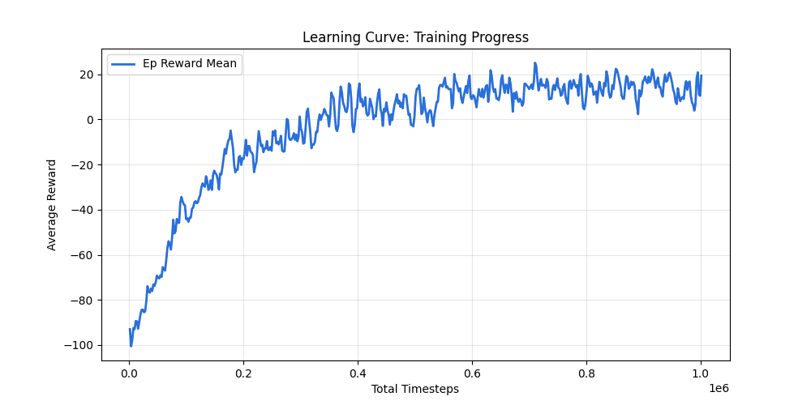
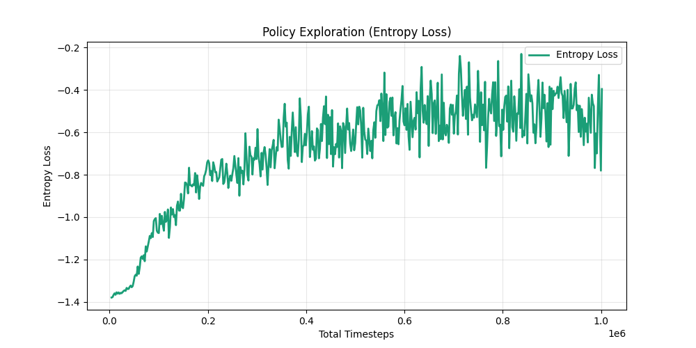
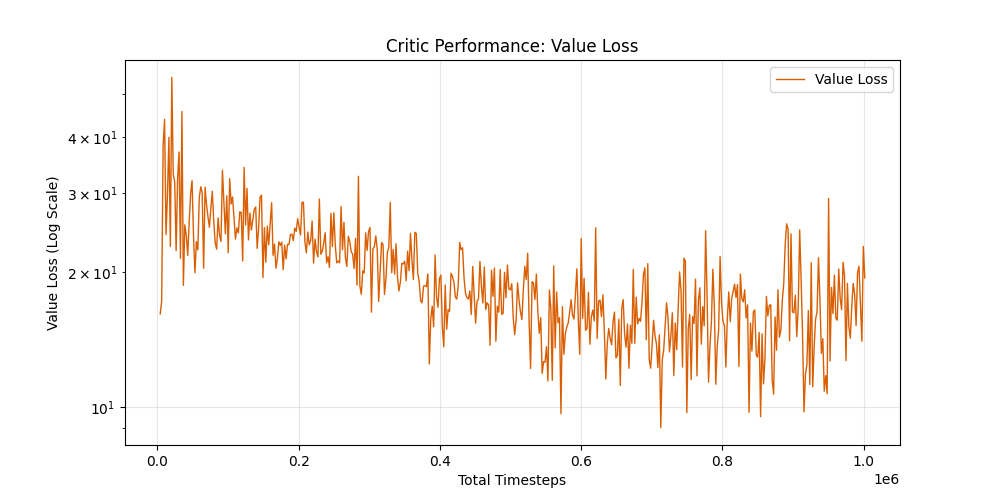
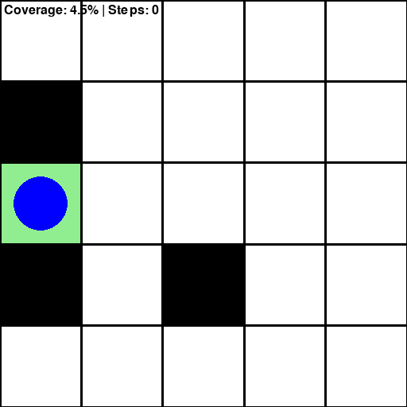
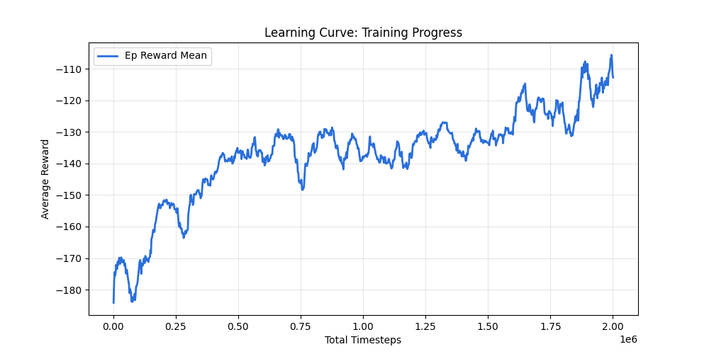
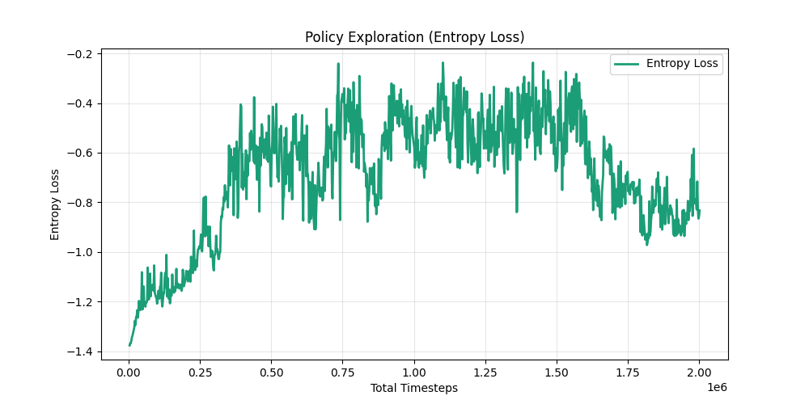
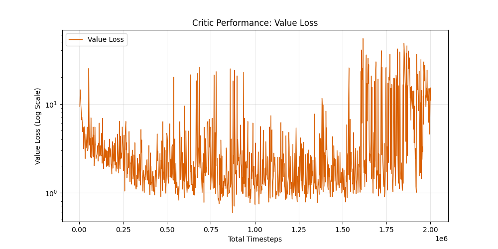
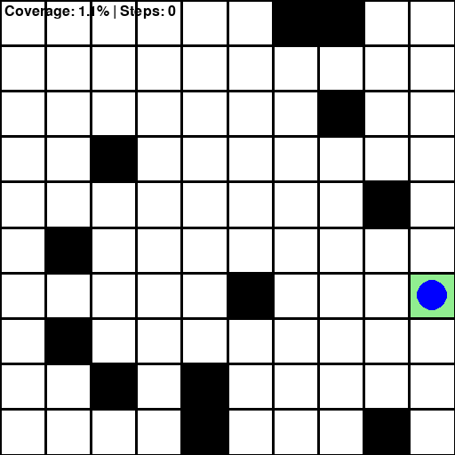

# Coverage Path Planning com Reinforcement Learning

**Atividade Prática Supervisionada – Reinforcement Learning**  
**Ana Beatriz Parra Ferreira**

Este projeto implementa um agente de **Reinforcement Learning (RL)** para o problema de **Coverage Path Planning (CPP)** em ambientes discretos, com foco em **generalização entre diferentes escalas** sob **observabilidade parcial (POMDP)**.

O objetivo do agente é explorar completamente um grid contendo obstáculos, maximizando a cobertura de células livres com o menor número de passos possível.


## Contexto do Problema

O CPP é um problema clássico em robótica, com aplicações em robôs de limpeza, drones de inspeção e exploração autônoma.

Neste projeto, o problema é modelado como um **POMDP**, no qual o agente não possui acesso ao mapa completo. Em vez disso, ele observa uma janela local (`obs_window`), um mapa global de células visitadas (`visited_map`), sua posição normalizada e o progresso de cobertura.

Essa limitação introduz desafios importantes, como ambiguidade entre células novas e revisitadas, dificuldade de planejamento de longo prazo e tendência a entrar em ciclos (loops).

## POMDP

Um **Partially Observable Markov Decision Process (POMDP)** é uma generalização dos MDPs em que o estado verdadeiro do ambiente não é diretamente observável. Em vez disso, o agente recebe observações parciais que não capturam completamente o estado global.

Formalmente, o POMDP é definido por estados ocultos, ações, observações, função de transição, função de observação e função de recompensa. Como o estado não é conhecido, o agente mantém uma **crença (belief)** — uma distribuição sobre estados possíveis.

No contexto deste projeto, a observação local (`obs_window`) não é suficiente para determinar o estado global do grid. O `visited_map` funciona como uma forma aproximada de memória, permitindo reduzir a incerteza ao longo do tempo.

Esse cenário gera ambiguidade estrutural: diferentes estados podem produzir a mesma observação. Isso dificulta distinguir regiões novas de regiões revisitadas e impacta diretamente a eficiência da política aprendida.

Além disso, como PPO assume implicitamente observabilidade completa, o aprendizado em POMDP torna-se mais instável e dependente de representações internas robustas. Isso explica a degradação de desempenho observada ao aumentar a escala do ambiente.


## Abordagem

O agente foi treinado utilizando **Proximal Policy Optimization (PPO)** com uma arquitetura baseada em CNN local para padrões espaciais imediatos, CNN global para o mapa de cobertura acumulado e MLP para o estado do agente.

Além disso, foi aplicada **reward shaping** para guiar a exploração, com recompensa por célula nova, bônus de fronteira, penalidade por revisita, penalidade por colisão e custo por passo.


## Resultados

### Ambiente 5×5

**Modelo:** `data/ppo_cpp_5_3_200_0.01_w5_20260508_155446`  
**Métricas:** `results/metrics_cpp_5_3_w5_20260508_185432.csv`  
**Logs:** `5x5/progress.csv`

```text
Full Coverage Rate:   94.00% (94/100)
Avg Coverage:         98.86% ± 6.47%
Min Coverage:         40.91%
Max Coverage:        100.00%
Avg Steps:            42.0 ± 42.8
Min Steps:            21
Max Steps:            200
```

**Análise**

O agente apresenta **convergência rápida e comportamento estável**, atingindo cobertura total na maioria dos episódios.

**Gráficos**

  
  


**Execução**




### Ambiente 10×10

**Modelo:** `data/ppo_cpp_10_12_400_0.01_w5_20260508_163746`  
**Métricas:** `results/metrics_cpp_10_12_w5_20260508_185712.csv`  
**Logs:** `10x10/progress.csv`

```text
Full Coverage Rate:   10.00% (10/100)
Avg Coverage:         94.69% ± 12.67%
Min Coverage:          1.14%
Max Coverage:        100.00%
Avg Steps:            387.2 ± 43.4
Min Steps:            191
Max Steps:            400
```

**Análise**

Apesar da alta cobertura média, o agente raramente completa o ambiente. Isso indica limitação de planejamento global e dificuldade em ambientes maiores sob POMDP.

**Gráficos**

  
  


**Execução**



## Comparação Geral

| Métrica       | 5×5    | 10×10 |
|---------------|--------|-------|
| Full Coverage | 94%    | 10%   |
| Avg Coverage  | 98.86% | 94.69% |

O agente aprende bem localmente, mas não escala adequadamente para ambientes maiores.


## Como Executar

### Treinar

```bash
# 5×5
python train_grid_world_cpp.py train 5 3 200 1000000 --obs-window 5

# 10×10
python train_grid_world_cpp.py train 10 12 400 2000000 --obs-window 5
```

### Testar

```bash
# 5×5
python train_grid_world_cpp.py test 5 3 \
  --model-path data/ppo_cpp_5_3_200_0.01_w5_TIMESTAMP.zip \
  --obs-window 5

# 10×10
python train_grid_world_cpp.py test 10 12 \
  --model-path data/ppo_cpp_10_12_400_0.01_w5_TIMESTAMP.zip \
  --obs-window 5 \
  --max-steps 400
```

### Executar (visualização)

```bash
python train_grid_world_cpp.py run 10 12 \
  --model-path data/ppo_cpp_10_12_400_0.01_w5_TIMESTAMP.zip \
  --obs-window 5 \
  --max-steps 400
```

### Gerar GIF

```bash
python generate_gif.py \
  --model-path data/seu_modelo.zip \
  --dim 10 \
  --obstacles 12 \
  --max-steps 400
```

### Plotar métricas

```bash
python plot_metrics.py \
  --log-csv progress.csv \
  --out-dir results/plots
```